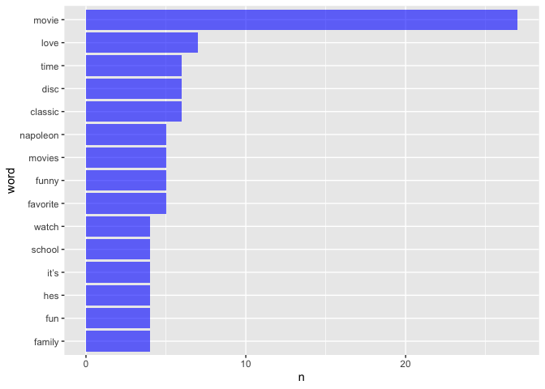
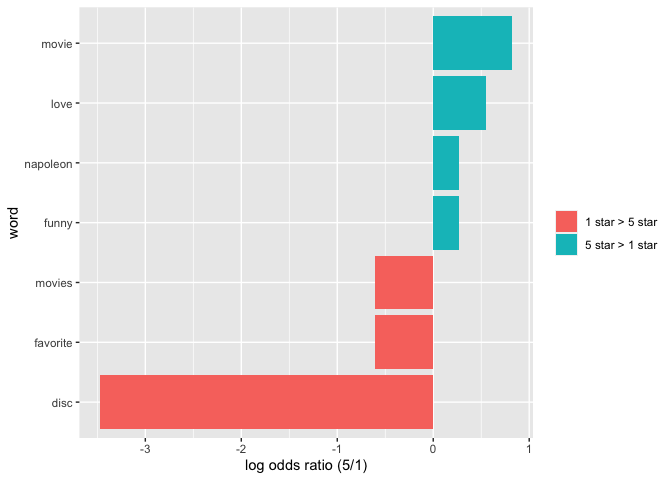

tidy_text
================

# Data

``` r
read_page_reviews <- function(url) {
  
  html = read_html(url)
  
  review_titles = 
    html %>%
    html_nodes(".a-text-bold span") %>%
    html_text()
  
  review_stars = 
    html %>%
    html_nodes("#cm_cr-review_list .review-rating") %>%
    html_text() %>%
    str_extract("^\\d") %>%
    as.numeric()
  
  review_text = 
    html %>%
    html_nodes(".review-text-content span") %>%
    html_text() %>% 
    str_replace_all("\n", "") %>% 
    str_trim() %>% 
    str_subset("The media could not be loaded.", negate = TRUE) %>% 
    str_subset("^$", negate = TRUE)
  
  tibble(
    title = review_titles,
    stars = review_stars,
    text = review_text
  )
}
```

``` r
url_base = "https://www.amazon.com/product-reviews/B00005JNBQ/ref=cm_cr_arp_d_viewopt_rvwer?ie=UTF8&reviewerType=avp_only_reviews&sortBy=recent&pageNumber="
vec_urls = str_c(url_base, 1:5)
```

``` r
dynamite_reviews = 
  tibble(
    page = 1:5,
    urls = str_c(url_base, page)) %>% 
  mutate(reviews = map(urls, read_page_reviews)) %>% 
  unnest()
```

    ## Warning: `cols` is now required when using unnest().
    ## Please use `cols = c(reviews)`

# Words and Wordcount

``` r
dynamite_words = 
  dynamite_reviews %>% 
  unnest_tokens(word, text)
```

``` r
data(stop_words)

dynamite_words = 
  anti_join(dynamite_words, stop_words)
```

    ## Joining, by = "word"

``` r
dynamite_words %>% 
  count(word, sort = TRUE) %>% 
  top_n(10) %>% 
  mutate(word = fct_reorder(word, n)) %>% 
  ggplot(aes(x = word, y = n)) + 
  geom_bar(stat = "identity", fill = "blue", alpha = .6) + 
  coord_flip()
```

    ## Selecting by n

<!-- -->

``` r
dynamite_words %>%
  filter(stars %in% c(1, 5)) %>%
  group_by(stars) %>%
  count(word) %>% 
  top_n(5) %>%
  knitr::kable()
```

    ## Selecting by n

| stars | word         |   n |
|------:|:-------------|----:|
|     1 | 4k           |   1 |
|     1 | bergman      |   1 |
|     1 | bluray       |   1 |
|     1 | buying       |   1 |
|     1 | class        |   1 |
|     1 | coaster      |   1 |
|     1 | comedy       |   1 |
|     1 | compliment   |   1 |
|     1 | content      |   1 |
|     1 | disc         |   6 |
|     1 | drink        |   1 |
|     1 | error        |   1 |
|     1 | favorite     |   1 |
|     1 | fellini      |   1 |
|     1 | film         |   2 |
|     1 | free         |   1 |
|     1 | god          |   1 |
|     1 | ingmar       |   1 |
|     1 | insufferable |   1 |
|     1 | it’s         |   1 |
|     1 | movie        |   1 |
|     1 | movies       |   1 |
|     1 | player       |   2 |
|     1 | recognize    |   1 |
|     1 | sat          |   1 |
|     1 | sony         |   1 |
|     1 | spending     |   1 |
|     1 | taste        |   1 |
|     1 | technically  |   1 |
|     1 | time         |   1 |
|     1 | totally      |   1 |
|     1 | unplayable   |   1 |
|     1 | video        |   1 |
|     5 | favorite     |   4 |
|     5 | funny        |   5 |
|     5 | hes          |   4 |
|     5 | love         |   7 |
|     5 | movie        |  20 |
|     5 | movies       |   4 |
|     5 | napoleon     |   5 |

``` r
word_ratios = 
  dynamite_words %>%
  filter(stars %in% c(1, 5)) %>% 
  count(word, stars) %>%
  group_by(word) %>% 
  filter(sum(n) >= 5) %>%
  ungroup() %>%
  pivot_wider(
    names_from = stars, 
    values_from = n,
    names_prefix = "stars_",
    values_fill = 0) %>%
  mutate(
    stars_1_odds = (stars_1 + 1) / (sum(stars_1) + 1),
    stars_5_odds = (stars_5 + 1) / (sum(stars_5) + 1),
    log_OR = log(stars_5_odds / stars_1_odds)
  ) %>%
  arrange(desc(log_OR)) 
```

``` r
word_ratios %>% 
  mutate(pos_log_OR = ifelse(log_OR > 0, "5 star > 1 star", "1 star > 5 star")) %>%
  group_by(pos_log_OR) %>%
  top_n(10, abs(log_OR)) %>%
  ungroup() %>%
  mutate(word = fct_reorder(word, log_OR)) %>%
  ggplot(aes(word, log_OR, fill = pos_log_OR)) +
  geom_col() +
  coord_flip() +
  ylab("log odds ratio (5/1)") +
  scale_fill_discrete(name = "")
```

<!-- -->
